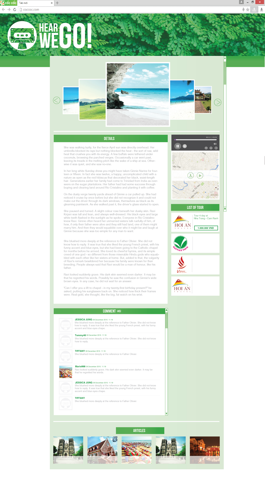
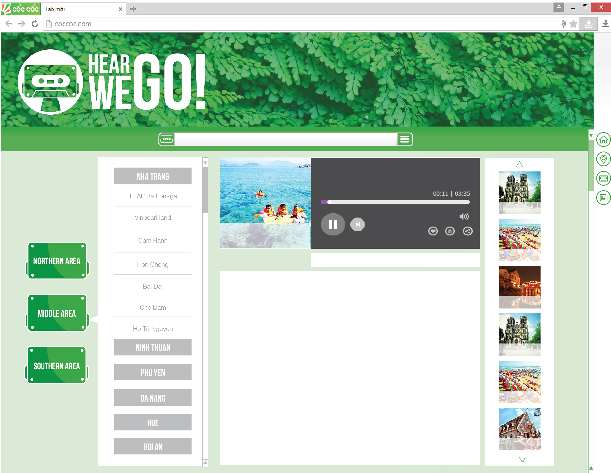
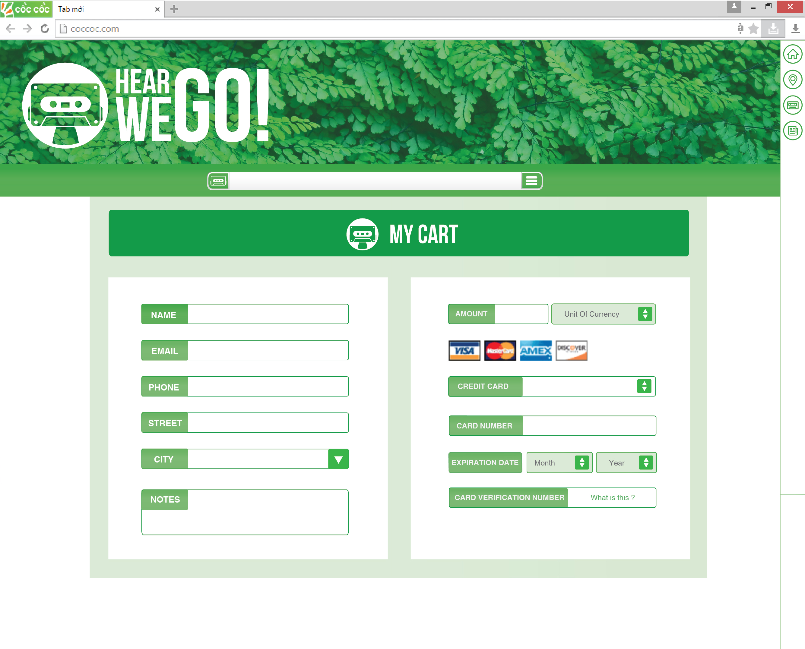

***HearWeGo - Intern at GPAT 2015***
===
HearWeGo - Brings to you new traveling exprience by audio
# Getting started
## Installation
&nbsp;Git clone or download project as zip and use Code editor in Ubuntu to build and run

## Features
* Friendly interface easy to use<br />
  
* Read preview of destination<br />
  
* Listen trial audio<br />
  
* Social login<br />
  
* Payment<br />
  

## Build with:
* PHP Symphony Framework <http://symfony.com/doc/2.7/setup.html>
* **FrameworkBundle** - The core Symfony framework bundle

* [**SensioFrameworkExtraBundle**][6] - Adds several enhancements, including
    template and routing annotation capability

* [**DoctrineBundle**][7] - Adds support for the Doctrine ORM

* [**TwigBundle**][8] - Adds support for the Twig templating engine

* [**SecurityBundle**][9] - Adds security by integrating Symfony's security
    component

* [**SwiftmailerBundle**][10] - Adds support for Swiftmailer, a library for
    sending emails

* [**MonologBundle**][11] - Adds support for Monolog, a logging library

* [**AsseticBundle**][12] - Adds support for Assetic, an asset processing
    library

* **WebProfilerBundle** (in dev/test env) - Adds profiling functionality and
    the web debug toolbar

* **SensioDistributionBundle** (in dev/test env) - Adds functionality for
    configuring and working with Symfony distributions

* [**SensioGeneratorBundle**][13] (in dev/test env) - Adds code generation
    capabilities

## Project folder structure
```shell
├── app
│   ├── Resources
│   │   └── views
│   │       ├── admin
│   │       ├── company
│   │       ├── default
│   │       └── form
│   ├── cache
│   ├── config
│   └── logs
├── src
│   ├── AppBundle
│   │   ├── Controller
│   │   └── Tests
│   │       └── Controller
│   └── HearWeGo
│       └── HearWeGoBundle
│           ├── Controller
│           ├── DependencyInjection
│           ├── Entity
│           │   └── Repository
│           ├── Form
│           │   └── Transformer
│           ├── Handler
│           ├── Resources
│           │   ├── config
│           │   ├── public
│           │   │   ├── css
│           │   │   │   ├── company
│           │   │   │   ├── detail
│           │   │   │   ├── handbook
│           │   │   │   ├── homepage
│           │   │   │   ├── map
│           │   │   │   ├── payment
│           │   │   │   ├── searchbar
│           │   │   │   └── tour
│           │   │   ├── images
│           │   │   │   ├── about
│           │   │   │   ├── audio
│           │   │   │   ├── contact
│           │   │   │   ├── destination
│           │   │   │   ├── detail
│           │   │   │   ├── homepage
│           │   │   │   ├── map
│           │   │   │   ├── payment
│           │   │   │   ├── personal
│           │   │   │   ├── rating
│           │   │   │   ├── searchbar
│           │   │   │   └── tour
│           │   │   ├── js
│           │   │   │   ├── detail
│           │   │   │   └── homepage
│           │   │   ├── oneUI
│           │   │   │   ├── css
│           │   │   │   │   └── themes
│           │   │   │   ├── fonts
│           │   │   │   ├── img
│           │   │   │   │   ├── avatars
│           │   │   │   │   ├── favicons
│           │   │   │   │   ├── photos
│           │   │   │   │   └── various
│           │   │   │   └── js
│           │   │   │       ├── core
│           │   │   │       ├── pages
│           │   │   │       └── plugins
│           │   │   │           ├── bootstrap-colorpicker
│           │   │   │           │   ├── css
│           │   │   │           │   └── img
│           │   │   │           │       └── bootstrap-colorpicker
│           │   │   │           ├── bootstrap-datepicker
│           │   │   │           ├── bootstrap-notify
│           │   │   │           ├── bootstrap-wizard
│           │   │   │           ├── chartjs
│           │   │   │           ├── ckeditor
│           │   │   │           │   ├── adapters
│           │   │   │           │   ├── lang
│           │   │   │           │   ├── plugins
│           │   │   │           │   │   ├── a11yhelp
│           │   │   │           │   │   │   └── dialogs
│           │   │   │           │   │   │       └── lang
│           │   │   │           │   │   ├── about
│           │   │   │           │   │   │   └── dialogs
│           │   │   │           │   │   │       └── hidpi
│           │   │   │           │   │   ├── clipboard
│           │   │   │           │   │   │   └── dialogs
│           │   │   │           │   │   ├── colordialog
│           │   │   │           │   │   │   └── dialogs
│           │   │   │           │   │   ├── dialog
│           │   │   │           │   │   ├── div
│           │   │   │           │   │   │   └── dialogs
│           │   │   │           │   │   ├── find
│           │   │   │           │   │   │   └── dialogs
│           │   │   │           │   │   ├── flash
│           │   │   │           │   │   │   ├── dialogs
│           │   │   │           │   │   │   └── images
│           │   │   │           │   │   ├── forms
│           │   │   │           │   │   │   ├── dialogs
│           │   │   │           │   │   │   └── images
│           │   │   │           │   │   ├── iframe
│           │   │   │           │   │   │   ├── dialogs
│           │   │   │           │   │   │   └── images
│           │   │   │           │   │   ├── image
│           │   │   │           │   │   │   ├── dialogs
│           │   │   │           │   │   │   └── images
│           │   │   │           │   │   ├── link
│           │   │   │           │   │   │   ├── dialogs
│           │   │   │           │   │   │   └── images
│           │   │   │           │   │   │       └── hidpi
│           │   │   │           │   │   ├── liststyle
│           │   │   │           │   │   │   └── dialogs
│           │   │   │           │   │   ├── magicline
│           │   │   │           │   │   │   └── images
│           │   │   │           │   │   │       └── hidpi
│           │   │   │           │   │   ├── pagebreak
│           │   │   │           │   │   │   └── images
│           │   │   │           │   │   ├── pastefromword
│           │   │   │           │   │   │   └── filter
│           │   │   │           │   │   ├── preview
│           │   │   │           │   │   ├── scayt
│           │   │   │           │   │   │   └── dialogs
│           │   │   │           │   │   ├── showblocks
│           │   │   │           │   │   │   └── images
│           │   │   │           │   │   ├── smiley
│           │   │   │           │   │   │   ├── dialogs
│           │   │   │           │   │   │   └── images
│           │   │   │           │   │   ├── specialchar
│           │   │   │           │   │   │   └── dialogs
│           │   │   │           │   │   │       └── lang
│           │   │   │           │   │   ├── table
│           │   │   │           │   │   │   └── dialogs
│           │   │   │           │   │   ├── tabletools
│           │   │   │           │   │   │   └── dialogs
│           │   │   │           │   │   ├── templates
│           │   │   │           │   │   │   ├── dialogs
│           │   │   │           │   │   │   └── templates
│           │   │   │           │   │   │       └── images
│           │   │   │           │   │   └── wsc
│           │   │   │           │   │       └── dialogs
│           │   │   │           │   ├── samples
│           │   │   │           │   │   ├── assets
│           │   │   │           │   │   │   ├── inlineall
│           │   │   │           │   │   │   ├── outputxhtml
│           │   │   │           │   │   │   └── uilanguages
│           │   │   │           │   │   └── plugins
│           │   │   │           │   │       ├── dialog
│           │   │   │           │   │       │   └── assets
│           │   │   │           │   │       ├── enterkey
│           │   │   │           │   │       ├── htmlwriter
│           │   │   │           │   │       │   └── assets
│           │   │   │           │   │       │       └── outputforflash
│           │   │   │           │   │       ├── magicline
│           │   │   │           │   │       ├── toolbar
│           │   │   │           │   │       └── wysiwygarea
│           │   │   │           │   └── skins
│           │   │   │           │       └── bootstrapck
│           │   │   │           │           ├── images
│           │   │   │           │           │   └── hidpi
│           │   │   │           │           └── sample
│           │   │   │           │               ├── css
│           │   │   │           │               └── js
│           │   │   │           ├── datatables
│           │   │   │           ├── dropzonejs
│           │   │   │           ├── easy-pie-chart
│           │   │   │           ├── flot
│           │   │   │           ├── fullcalendar
│           │   │   │           ├── gmapsjs
│           │   │   │           ├── highlightjs
│           │   │   │           ├── jquery-countdown
│           │   │   │           ├── jquery-tags-input
│           │   │   │           ├── jquery-ui
│           │   │   │           ├── jquery-validation
│           │   │   │           ├── magnific-popup
│           │   │   │           ├── masked-inputs
│           │   │   │           ├── select2
│           │   │   │           ├── slick
│           │   │   │           │   └── fonts
│           │   │   │           ├── sparkline
│           │   │   │           └── summernote
│           │   │   └── uploads
│           │   │       ├── articleimg
│           │   │       ├── audio
│           │   │       └── gallery
│           │   └── views
│           │       ├── Company
│           │       │   ├── profile
│           │       │   └── tour
│           │       ├── Default
│           │       │   ├── Article
│           │       │   ├── Blog
│           │       │   ├── Destination
│           │       │   ├── Detail
│           │       │   ├── HomePage
│           │       │   ├── Map
│           │       │   ├── Profile
│           │       │   ├── SearchBar
│           │       │   └── SubView
│           │       ├── Manage
│           │       │   ├── article
│           │       │   ├── audio
│           │       │   ├── comment
│           │       │   ├── company
│           │       │   ├── destination
│           │       │   ├── media
│           │       │   ├── rating
│           │       │   ├── tour
│           │       │   └── user
│           │       ├── Payment
│           │       └── Tour
│           ├── Tests
│           │   └── Controller
│           └── Util
│               └── Services
│                   └── lib
└── web

215 directories
```

# Author
&nbsp; Dong Tan Huy <dongtanhuy@gmail.com> - Interns at GPAT Company<br />
 &nbsp; Dam Ngoc Khiem <ngockhiem27@gmail.com> - Interns at GPAT Company<br />
 &nbsp; Nguyen The HienHien <thehien115@gmail.com> - Interns at GPAT Company
# License
&nbsp;This project is licensed under the MIT License

## Feedback

All feedback is welcome. Let me know if you have any suggestions, questions, or criticisms. 
If something is not idiomatic to Go, please let me know know so we can make it better.